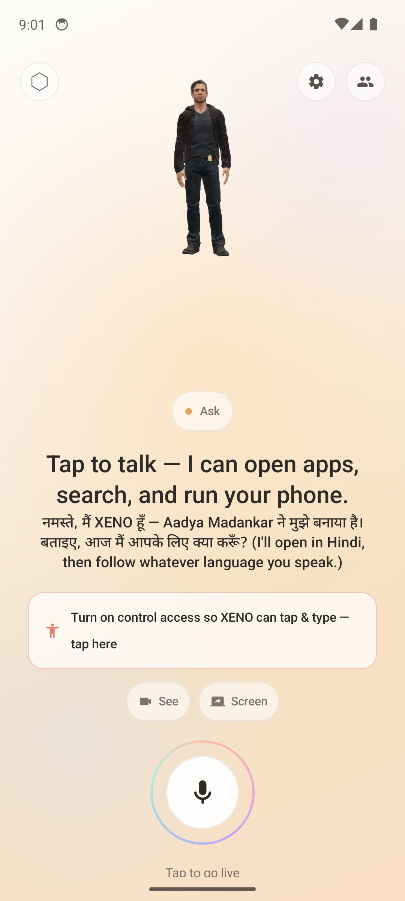
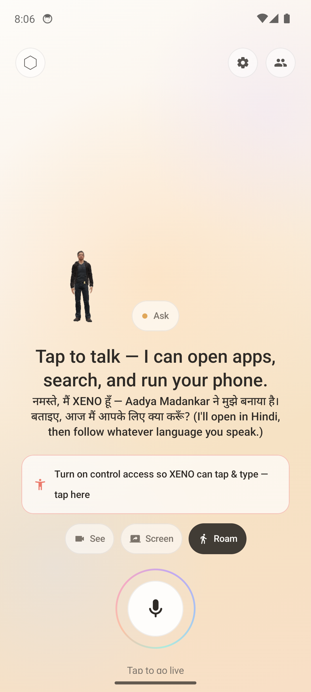
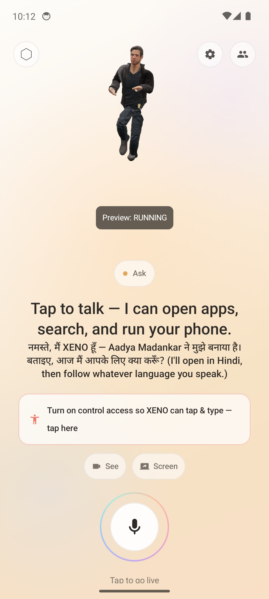
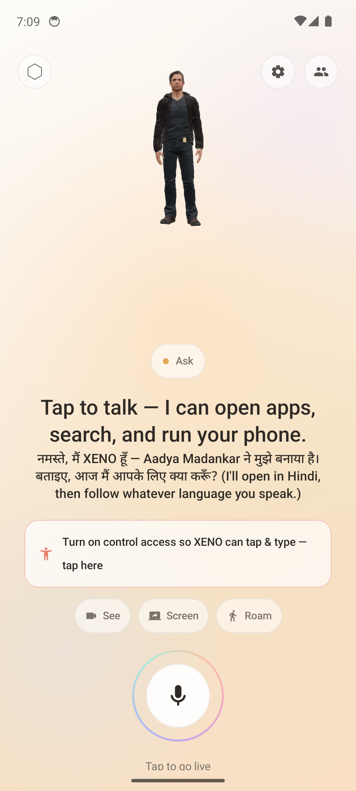
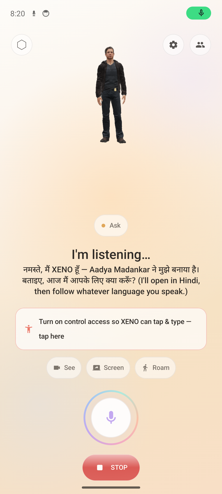
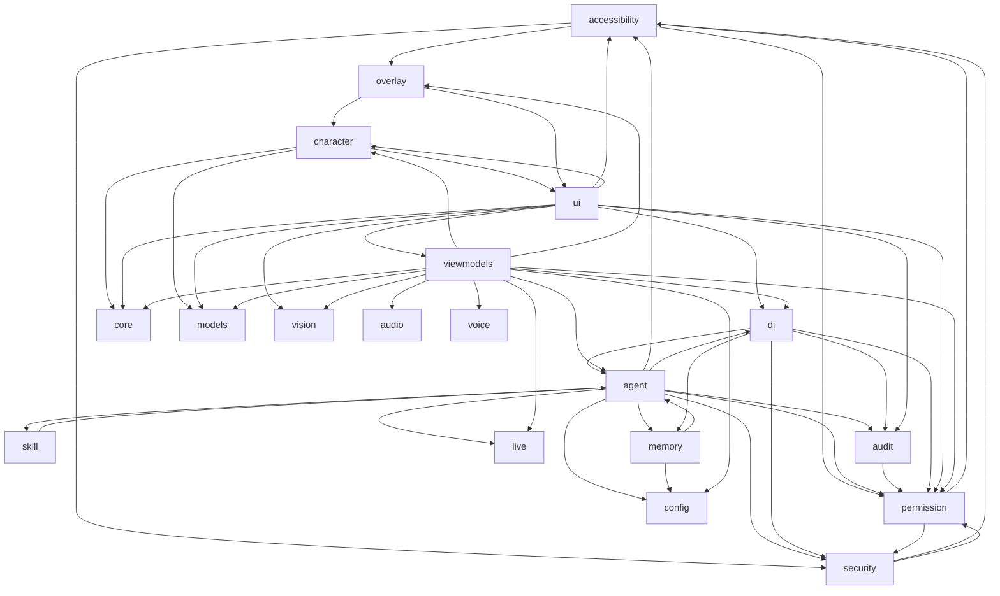

# Xeno Live

**Your phone, driven by voice — with a 3D human who roams the screen to do it.**

Xeno Live is a voice-first Android AI agent that holds a real-time conversation over the Gemini Live API and, on request, operates your phone for you through Android's AccessibilityService. Every action runs behind a assistant-style permission and autonomy system, so banking apps, passwords, and OTP fields stay strictly off-limits. It's embodied by Gavin, a realistic 3D character who walks out of the app and works your screen as a floating overlay.

- **Talk** — real-time speech-to-speech voice conversation (opens in Hindi, follows your language).
- **Operate your phone by voice** — ~34 phone-control tools that tap, type, scroll, open apps, set alarms, and toggle settings, each gated by the permission engine.
- **Roam your screen as a 3D character** — Gavin breaks out of the app and walks/runs across your whole screen as a floating overlay, operating other apps, then returns.



## Table of contents

- **Features**
  - [Talk](#talk)
  - [Operate your phone by voice](#operate-your-phone-by-voice)
  - [Roam](#roam)
  - [Teach it & remember](#teach-it--remember)
  - [See](#see)
- [Demo](#demo)
- [Safety & permission model](#safety--permission-model)
- [How it works](#how-it-works)
- [Architecture graph](#architecture-graph)
- [Project layout](#project-layout)
- [Tech stack](#tech-stack)
- [Build & run](#build--run)
- [Install on a device](#install-on-a-device)
- [Limitations & honest caveats](#limitations--honest-caveats)
- [Credits](#credits)
- [License](#license)

## Talk

Tap the mic and XENO holds a full-duplex voice conversation over a single Gemini Live WebSocket — mic audio streams up as PCM16, the model's voice streams back (Fenrir) and drives the 3D character's amplitude and lip-sync. It opens in Hindi and follows whatever language you switch to. Barge-in is instant: start talking and queued playback flushes so it stops mid-sentence. The same socket carries tool calls, so a spoken request can turn into phone actions without a second round trip. Sessions auto-fail-over across your Gemini API keys on quota or auth errors.

## Operate your phone by voice

Just talk. XENO maps what you say to ~34 on-device tools, runs each through the permission gate, and reports back by voice. Grouped by what they touch:

| Group | Tools | Say something like |
|---|---|---|
| **Screen control** (needs Accessibility grant) | `tap` `input_text` `scroll` `swipe` `long_press` `press_back` `press_home` `press_recents` `open_notifications` `get_screen` `take_screenshot` | "Tap the blue Follow button." · "Scroll down and open the first result." |
| **Apps & intents** | `open_app` `open_url` `web_search` `navigate` `share` | "Open Spotify." · "Navigate home." · "Search for ramen near me." |
| **Drafts** (XENO prefills, you hit send) | `email_draft` `sms_draft` `dial` `add_event` | "Text Mom that I'll be late." · "Draft an email to Sam about Friday." |
| **Alarms & timers** | `set_alarm` `set_timer` | "Set an alarm for 7am." · "Timer for 10 minutes." |
| **System toggles** | `torch` `set_brightness` `set_dnd` `set_volume` `media_play_pause` `open_wifi_panel` `open_bluetooth_settings` `open_settings` | "Turn on the flashlight." · "Do not disturb until noon." · "Turn it down." |

**Screen control needs the Accessibility grant.** Tapping, typing, and scrolling other apps run through XENO's AccessibilityService, so those tools stay inert until you enable it (choosing Auto or Bypass mode prompts for it). Everything else — opening apps, drafts, alarms, toggles — works without it.

Drafts are deliberately hands-off-the-last-step: XENO fills in the recipient, body, number, or event, then hands you a prefilled Messages / email / dialer / calendar screen so *you* press send. Send buttons, banking and wallet apps, and password/OTP/CVV fields are hard-blocked regardless of mode.

## Roam

When a task needs the phone, XENO doesn't stay boxed inside the app — it **leaves**. The moment an agent task starts running, XENO breaks out of the app and becomes a floating 3D character (Nazim) that walks and runs around your entire screen, operating other apps in front of you, then returns to the app when the task finishes. There is **no manual button**: roaming is triggered by the agent going active and torn down when it goes idle.



**Break-out.** A glass-shatter motion graphic plays once as XENO steps out of the app — a real Lottie animation (`assets/glass_break.json`, drop-in). The first time XENO ever needs to leave, it asks once for the "Display over other apps" grant; after that it comes and goes on its own.

**Walk / run to every tap.** The overlay is a `TYPE_APPLICATION_OVERLAY` foreground service hosting the same real 3D character in a Compose window on top of every app. Each time the accessibility engine taps the screen, it emits the tap coordinates on `OverlayBus` and the character travels to that exact spot — **walking** for short hops, **running** for long ones — faces the direction of travel, and throws a "press" (Punch) animation as the tap lands, so you literally watch a person operate your phone. It uses idle plus transplanted Mixamo Walk/Run clips.



When it isn't travelling, the floating character mirrors the live session — expression and voice amplitude — and you can drag it anywhere. When the task completes, XENO walks back and the overlay closes.

> Note: Walk/Run were retargeted from a different Mixamo rig, so the run uses an approximated forward lean.

## Teach it & remember

XENO doesn't just run one-off commands — it can learn a routine, remember you across sessions, and rewrite its own instructions. All three stores are on-device (a JSON file plus a Room DB); nothing here syncs to the cloud.

### Skills — save a routine, get a new tool

`save_skill` records an ordered list of tool calls under a name. From then on that skill is advertised to the model as its **own callable tool**, `skill_<name>` (name lowercased, non-alphanumerics collapsed to `_`). When the model calls it, `AgentCoordinator` expands the skill into its steps and runs each one as an ordinary tool call **through the same permission gate** — a skill is a macro over existing tools, so it grants no new authority (and a step that names another skill is blocked, no recursion). `list_skills` summarizes what's saved; `recall_skill` returns a skill's steps as data without running them.

**Example**

> You: "Every morning I open Spotify and start my Focus playlist — save that as 'morning focus'."

XENO calls `save_skill`:

```json
{
  "name": "morning focus",
  "description": "Open Spotify and play the Focus playlist.",
  "steps": [
    { "tool": "open_app", "args": { "query": "Spotify" } },
    { "tool": "tap", "args": { "index": 12 } },
    { "tool": "media_play_pause", "args": {} }
  ]
}
```

Next day you just say "run morning focus" — the model invokes `skill_morning_focus`, and each step (open, tap, play) is replayed step-by-step, still subject to your autonomy mode and any block on a secure screen.

### Long-term memory — remember / recall / note_intention / forget

Durable memory of you, kept across sessions in an on-device Room DB. `NORMAL` facts and pending intentions are folded into the next session's system prompt at connect, so XENO starts already knowing them.

- **`remember`** — save a durable fact (names, preferences, relationships, routines). `sensitivity` is `normal` (recalled and injected into future prompts), `private`, or `secret` — **`private`/`secret` facts never leave the device, are never returned by `recall`, and are never folded into the prompt**. Never store raw passwords or OTPs.
- **`recall`** — natural-language `query` over stored facts.
- **`note_intention`** — prospective memory ("remember to do X"); surfaced at the next session start, or by a `time` / `app_open` / `topic` trigger.
- **`forget`** — remove a stored memory (makes `remember` reversible).

**Example**

> You: "My wife's name is Priya, and remind me to renew my passport next week."

XENO calls `remember` then `note_intention`:

```json
{ "text": "The user's wife is named Priya", "subject": "person:priya", "key": "wife_name", "value": "Priya" }
```
```json
{ "text": "Remind the user to renew their passport", "trigger": "manual" }
```

A week later, on your next session XENO opens already knowing Priya and raises the passport reminder unprompted.

### Self-prompt — XENO edits its own instructions

`update_self_prompt` lets XENO write a short directive to itself about how to behave or speak. It's stored on-device (`PersonaStore`) and appended to the base persona system instruction **at the next session connect** — so it shapes behavior from the following session on, not mid-conversation. `mode` is `append` (default, adds a note) or `replace` (rewrites the whole self-note).

**Example**

> You: "From now on, keep your answers short and always greet me in Marathi."

XENO calls `update_self_prompt`:

```json
{ "directive": "Keep replies concise. Always open the conversation in Marathi.", "mode": "append" }
```

It replies that it's saved the note, and every session after this one opens in Marathi and stays terse.

## See

Optionally share live video so XENO can see what the accessibility tree can't — the world, games, video, WebViews. Tap **See** to stream the camera or **Screen** to mirror your display; frames are downscaled and throttled to ~1fps JPEGs sent to Gemini Live. Only one source streams at a time, and vision is off until you turn it on.

## Demo



*Gavin — the 3D human that embodies XENO, rendered with SceneView/Filament.*



*A live voice session, with the panic STOP that halts the agent and closes the connection.*

Screen recordings (drag-to-play in the README on GitHub):

https://github.com/user-attachments/assets/demo-walk-run

*Walk/Run: the avatar roams your whole screen as a floating overlay, operating other apps.* ([docs/media/demo-walk-run.mp4](docs/media/demo-walk-run.mp4))

https://github.com/user-attachments/assets/demo-idle

*Idle: the character breathing and blinking on the live companion screen.* ([docs/media/demo-idle.mp4](docs/media/demo-idle.mp4))

> Note on the mp4 embeds: GitHub only auto-plays an mp4 when the file is **dragged into the README editor** (or pasted), which uploads it to `user-attachments` and rewrites the URL — a raw `docs/media/*.mp4` path renders as a plain link, not a player. The two `user-attachments/assets/...` lines above are placeholders; replace them by dragging each mp4 into the README on github.com. The relative-path links are kept as a fallback so the section works even before that drag step.

## Safety & permission model

XENO can drive your phone, so every model tool call passes through an on-device permission gate before anything runs. The gate is a four-layer, first-match decision — **denylist → forced-ask → secure-context → mode + standing rules** — and the first three layers apply in *every* autonomy mode, including Bypass. The autonomy mode only sets the baseline for ordinary, reversible actions.

### Autonomy modes

| Mode | Runs without asking | Everything else |
|------|--------------------|-----------------|
| **Ask** | Nothing side-effecting (reads the screen freely) | Confirmed with a preview sheet |
| **Ask-less** | The fixed SAFE whitelist (open app, search, toggles, drafts, timers) | Confirmed |
| **Auto** *(default)* | SAFE actions, silently | GUARDED actions confirmed; BLOCKED refused |
| **Bypass** *(opt-in)* | Everything that clears the guards below | Forced-ask + secure contexts still confirmed |

Fresh installs start in **Auto**. A corrupt or unknown persisted value falls back safely, and tripping a rate/loop guard reverts the mode to **Ask**. Selecting **Auto** or **Bypass** prompts to grant the Accessibility service if it isn't enabled (reading and acting on other apps' screens requires it); screen-independent actions like `open_app` are never gated on a readable screen.

### Always blocked

These contexts are hard-blocked in Ask / Ask-less / Auto, and in Bypass still require an explicit extra confirm rather than running silently:

- **Banking / wallet / authenticator apps** (package denylist)
- **Password fields** (`isPassword` / password input type)
- **OTP / CVV / PIN / card-number fields** (matched on hint, description, or resource-id)
- **FLAG_SECURE screens** (windows the OS marks as screenshot-protected)
- **Locked device** (keyguard showing)
- Android 14+ nodes the framework marks accessibility-sensitive

Independently, a set of **forced-ask** actions can *never* auto-run and can never receive a standing "always allow" grant, in any mode: send message, send email, place call, purchase, delete data, install/uninstall app, change a security setting. Because the agent drives apps by tapping their own buttons, a generic tap on a **Send / Pay / Transfer / Confirm / Delete** control is escalated to a forced confirm too — and an unidentifiable tap fails closed (confirm required) rather than being assumed harmless.

### On-device redaction

Before any screen reaches Gemini, a stateless redactor scrubs it on-device: card numbers, IBANs, OTPs, tokens, emails, and seed phrases are masked, sensitive hints and resource-ids are dropped, password/secure fields are blanked, and the screen-level secure flag is forced (fail-closed on denylisted apps). This runs on *every* screen result via a redacting executor decorator, so raw sensitive text cannot leave the device. Confirm-sheet values are masked the same way — the literal text typed into a password/OTP field is never even shown.

### Append-only audit log

Every permission decision and action outcome is recorded to an append-only Room log: which tool ran, in which mode, against which app, and how it was decided. It deliberately stores **no raw parameters** — no message bodies, numbers, or amounts — so the history itself can't leak anything. Recent activity is viewable in the settings sheet.

### Panic STOP

The STOP control trips a global kill switch that (1) synchronously fires listeners to cancel in-flight gestures, (2) gates any new tool dispatch via a StateFlow latch, and (3) tears the session down — closing the Live WebSocket and stopping audio and vision. It halts the agent *and* drops the connection, not just the current step.

### Rate & loop guards

- **Rate limiter** — throttles actions per session; exceeding the threshold trips back to Ask.
- **Loop controller** — a step cap (~25) plus repeat/stuck ring-buffer fingerprint detection and a thread-safe cancel latch, so a confused model can't spin or hammer the same action.

## How it works

A single Gemini Live WebSocket carries both the voice conversation and the model's tool calls; everything the model asks to do on the phone passes through one gate (`AgentCoordinator`) before it can touch the screen. `XenoViewModel` owns the session, marshals the off-main WebSocket/audio callbacks back onto its scope, and projects state as the flows the Compose `LiveScreen` collects. A voice request flows like this:

1. **Capture** — `AudioCapture` records the mic as PCM16 mono 16 kHz on a daemon thread; `XenoViewModel`'s `onPcm` callback hands each chunk to `GeminiLiveClient.sendAudioChunk`.
2. **Uplink** — `GeminiLiveClient` (one OkHttp WebSocket, BidiGenerateContent) streams that audio up; tool declarations were advertised at `setup` via `GeminiToolMapper.toLiveTool` over `ToolRegistry.declarations()`.
3. **Tool call in** — Gemini decides to act and returns a `LiveFunctionCall`; the client parses the server frame into `Listener.onToolCall`, which `XenoViewModel` forwards to `AgentCoordinator.handleToolCalls`.
4. **Gate** — for each call `AgentCoordinator` maps it with `GeminiToolMapper.toAgentAction`, checks `KillSwitch`, runs `AgentLoopController.onBeforeStep` (step cap + stuck-fingerprint), then `PermissionEngine.decide(action, mode, screen, keyguardLocked)` → Allow / Confirm / Block. **Confirm** suspends the coroutine on a `CompletableDeferred`, emits `pendingConfirm` for `ConfirmSheet`, and resumes on `resolveConfirm`; `RateLimiter` and the Room `AuditLog` record the disposition.
5. **Dispatch** — allowed calls go to `DefaultPhoneControlExecutor.execute`, which looks the `AgentTool` up by name in `ToolRegistry` (e.g. `TapTool`).
6. **Act** — the tool calls `Accessibility.controller` (`AgentAccessibilityService` implementing `AccessibilityController`), which acts through `NodeActionExecutor` (index-targeted `performAction` with a `GestureDispatcher` coordinate fallback that also fires `OverlayBus.emitTap` so the roaming avatar walks to the tap) — or fires an intent for non-screen tools.
7. **Observe** — the tool reads the new screen via `controller.readScreen()` (`ScreenReader` DFS → `ScreenState`) and returns it in `ToolResult`; `ServiceLocator`'s `RedactingExecutor` runs `ScreenRedactor` over it so secrets never leave the device.
8. **Reply** — `AgentCoordinator` returns the results; `XenoViewModel` sends them back via `GeminiLiveClient.sendToolResponse`. Gemini's spoken answer arrives as PCM16 24 kHz on `onAudio` → `AudioStreamPlayer`, whose per-chunk RMS amplitude drives the `NazimView` avatar.

## Architecture graph

Directed dependency graph of the app's packages, one edge `A --> B` per `A dependsOn B`; the cluster around `agent` / `permission` / `accessibility` / `security` is the mutually-recursive safety-and-execution core, while `di`, `viewmodels`, and `ui` are the top-level wiring/entry layers and `audio`, `live`, `vision`, `core`, `models`, `config`, `voice` are dependency-free leaves.



## Project layout

```
app/src/main/java/com/example/
├── MainActivity.kt      Single Activity host; mounts LiveScreen and the app theme.
├── accessibility/       AccessibilityService that reads the live screen (set-of-marks) and drives it (semantic action + gesture fallback); fail-secure context detection.
├── agent/               Tool-calling brain: gates every model tool call (permission, kill switch, rate/loop guard, audit) and dispatches the ~34 phone-control tools.
├── audio/               Realtime mic capture (PCM16 16kHz) and model playback (24kHz), with per-chunk amplitude for the avatar.
├── audit/               Append-only Room audit log of permission decisions and action outcomes (stores no raw params).
├── character/           The 3D character "face": SceneView/Filament GLB render, skeletal animation, viseme lip-sync, expressions, and XENO's persona/system-instruction.
├── config/              DataStore persistence for Gemini API keys and XENO's self-authored persona directive.
├── core/                Shared domain types for the session lifecycle (CompanionState) and chat transcript.
├── di/                  Manual DI container (ServiceLocator) wiring the permission stack, audit/memory, PII redactor, and tool executor as singletons.
├── live/                Gemini Live transport: one OkHttp WebSocket + Moshi DTOs for BidiGenerateContent (audio/video up, events + tool calls back).
├── memory/              On-device long-term memory (episodic/semantic/prospective) over Room, with recall scoring and boot-context assembly.
├── models/              The Persona data class and the built-in persona catalog.
├── overlay/             ROAM: TYPE_APPLICATION_OVERLAY foreground service that walks/runs the avatar across the whole screen; OverlayBus is the process-wide bridge.
├── permission/          assistant-style permission/autonomy core: Allow/Confirm/Block gate, kill switch, secure-context detection, denylists, rate/loop limits.
├── security/            On-device redaction of sensitive text from a ScreenState before it is serialized to the cloud.
├── skill/               On-device skill memory: save/list/recall named tool-call sequences (JSON file) as replayable skills.
├── ui/                  Jetpack Compose UI: the warm-light LiveScreen, the modal agent sheets, reusable components, and the XenoWarm theme.
├── viewmodels/          The single XenoViewModel, wiring Live/audio/agent/vision/overlay into one session and projecting it as StateFlows.
├── vision/              Optional ~1fps downscaled-JPEG video from the camera or screen to the Gemini Live client.
└── voice/               Minimal microphone foreground service that keeps mic capture alive while the app is backgrounded.
```

## Tech stack

- **Kotlin** — sole language across ~118 source files; app targets Android 12+ (minSdk 31), targetSdk 36.
- **Jetpack Compose + Material 3** — single-Activity UI: one warm-light `LiveScreen` plus modal permission/settings/STOP sheets.
- **Gemini Live API** — one OkHttp WebSocket carries the realtime voice loop and tool calls; Moshi maps the BidiGenerateContent DTOs.
- **SceneView / Filament** — renders the 3D character "Gavin" (GLB) with per-frame skeletal animation and blendshapes, with a Compose fallback portrait.
- **Lottie** — motion graphics, including the glass-break effect played when XENO roams out of the app.
- **Room** — append-only audit log plus the four-layer on-device long-term memory (episodic/semantic/prospective).
- **DataStore** — reactive on-device config for Gemini API keys and XENO's self-authored persona directive.
- **AccessibilityService** — the read-and-act engine that observes the live screen tree and drives taps/text/scroll for phone control.
- **CameraX / MediaProjection** — optional vision: streams throttled ~1fps JPEG frames of the camera ("See") or screen ("Screen") to Gemini.

## Build & run

Standard Android app (Kotlin, Jetpack Compose). Builds from the command line with the Gradle wrapper — no global Gradle install needed.

**Prerequisites**
- JDK 17 (e.g. `brew install openjdk@17`)
- Android SDK: platform `android-36` + build-tools 36.0.0 + platform-tools
  ```bash
  sdkmanager "platforms;android-36" "build-tools;36.0.0" "platform-tools"
  ```
- A Gemini API key (server-side Live API)

**Build the debug APK**
```bash
# 1. Point the build at your JDK + SDK
export JAVA_HOME=/opt/homebrew/opt/openjdk@17
export ANDROID_HOME="$HOME/Library/Android/sdk"

# 2. Provide your Gemini key (read by the Secrets Gradle plugin from .env)
echo "GEMINI_API_KEY=your_real_key" > .env

# 3. Build
./gradlew :app:assembleDebug
```

The APK lands at:
```
app/build/outputs/apk/debug/app-debug.apk
```

**Android Studio alternative:** open the project and Run — it resolves the SDK and JDK for you. You still need the `.env` entry for the Gemini key.

## Install on a device

Xeno Live is **sideload-only** — Google Play prohibits plan-and-execute accessibility agents, so it is not distributed through the Play Store.

### 1. Sideload the debug APK

Build it, then install over USB (or copy the APK to the device and open it):

```bash
./gradlew assembleDebug
adb install -r app/build/outputs/apk/debug/app-debug.apk
```

The APK lands at `app/build/outputs/apk/debug/app-debug.apk`. Requires a real device on Android 12+ (minSdk 31) — the emulator mic is silent, so live voice needs physical hardware.

### 2. First-run setup

Grant these in order on first launch:

1. **Microphone** — accept the mic permission prompt so Xeno can hear you. Without it there is no voice session.
2. **Gemini API key** — open **Settings** (the gear) -> **API keys** and paste a key from Google AI Studio. Live voice does not connect without one. You can add several; Xeno fails over between them on quota/auth errors.
3. **Accessibility** — enable the service so Xeno can read and operate the screen: **Settings -> Accessibility -> Xeno Live** (Android system Settings, not the in-app sheet). Selecting Auto or Bypass autonomy mode will also prompt for this if it is missing.
4. **Display over other apps** — allow this so Xeno can roam: the 3D character breaks out of the app and walks around your screen as a floating overlay while it operates other apps. You are prompted the first time roaming is triggered.

Steps 1–2 are required for voice. Steps 3–4 are required for phone control and roaming.

## Limitations & honest caveats

- **No live voice on an emulator.** The Android emulator's mic is silent, so a realtime voice conversation needs a real device plus your own Gemini API key.
- **No mouth lip-sync.** The character model ships without facial blendshapes, so speech drives amplitude reactions but not visible mouth movement.
- **Approximated run.** Walk and Run are Mixamo clips retargeted from a different rig, so the run uses an approximated forward lean rather than a purpose-authored gait.
- **Sideload-only.** Google Play bans plan-and-execute accessibility agents, so this app class cannot be distributed through the Play Store.
- **Placeholder character.** The bundled "Gavin" is a CC-BY Sketchfab model of a copyrighted game character (IP belongs to Quantic Dream) — fine as a dev placeholder, not for commercial release.

## Credits

- **Gavin avatar** (`app/src/main/assets/nazim.glb`) — based on ["Gavin Reed - Detroit Become Human"](https://sketchfab.com/3d-models/gavin-reed-detroit-become-human-0161bd8ecbaa44cb9da40ba4f2f80aaf) by [qsardor](https://sketchfab.com/qsardor57913), licensed [CC-BY-4.0](http://creativecommons.org/licenses/by/4.0/).
- **Walk / Run animations** — retargeted bone-for-bone onto Gavin's Mixamo skeleton from the [three.js Soldier](https://threejs.org/examples/models/gltf/Soldier.glb) model (Mixamo animation set, royalty-free under Adobe's license).
- **Motion graphics** — [Lottie](https://airbnb.io/lottie/) for the roam glass-break effect (`assets/glass_break.json`).

See [`ASSET_CREDITS.md`](ASSET_CREDITS.md) for full attribution and licensing notes.

## License

- Original XENO code is released under the [MIT License](LICENSE).
- Bundled assets carry their own licenses — see [ASSET_CREDITS.md](ASSET_CREDITS.md). The 3D character (`nazim.glb`) is a CC-BY Sketchfab model, but the depicted character is third-party IP (*Detroit: Become Human* / Quantic Dream).
- Because of that character asset, the repo **as bundled** is not cleanly redistributable for commercial use. The MIT code is; swap in an original or properly-licensed `.glb` before any commercial release.
